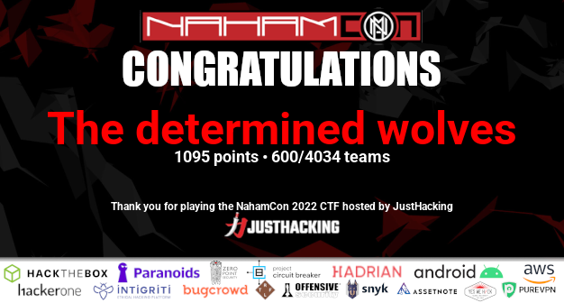
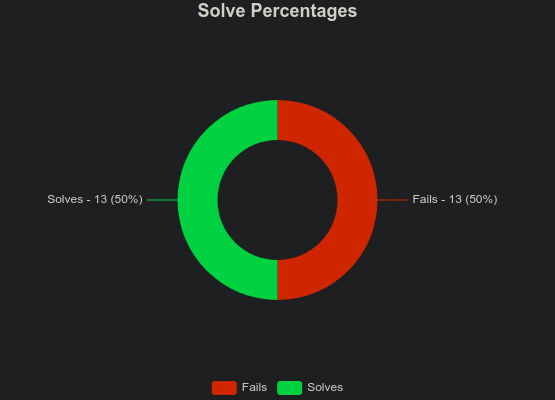
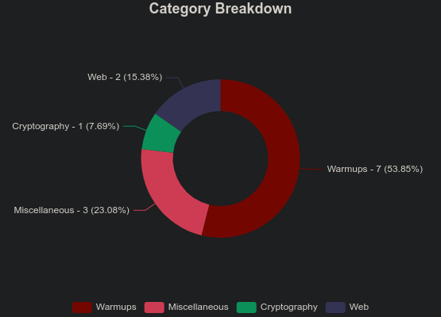
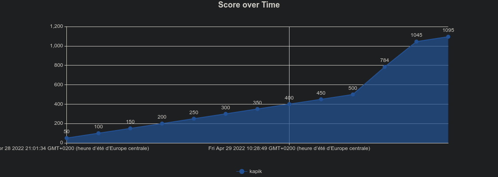

# NahamCon CTF 2022 - 600th/4034 teams - 1095 points
Notes from the NahamCon CTF 2022

**600/4034 (1095 points)**

## Challenges

### Completed challenges
* [Exit VIM (Warmup) (50 points)](./warmup/exit_vim_COMPLETED)
* [EXtravagant (Web) (50 points)](./web/extravagant_COMPLETED)
* [Flagcat (Warmup) (50 points)](./warmup/flagcat_COMPLETED)
* [Jurassik Park (Web) (50 points)](./web/jurassic_park_COMPLETED)
* [Prisoner (Warmup) (50 points)](./warmup/prisoner_COMPLETED)
* [Quirky (Warmup) (50 points)](./warmup/quirky_COMPLETED)
* [Read the Rules (Warmup) (50 points)](./warmup/read_the_rule_COMPLETED)
* [Steam Locomotive (Miscellaneous) (50 points)](./miscellaneous/steam_locomotive_COMPLETED)
* [Technical Support (Warmup) (50 points)](./warmup/technical_support_COMPLETED)
* [To Be And Not To Be (Miscellaneous) (261 points)](./miscellaneous/to_be_and_not_to_be_COMPLETED)
* [Unimod (Cryptography) (50 points)](./cryptography/unimod_COMPLETED/)
* [WhenAmI (Miscellaneous) (284 points)](./miscellaneous/whenami_COMPLETED)
* [Wizard (Warmup) (50 points)](./warmup/wizard_COMPLETED/)

### Unfinished challenges
* [Babiersteps (Binary Exploitation)](./binary_exploitation/babiersteps)
* [Baby RSA Quizz (Cryptography)](./cryptography/baby_rsa_quizz/)
* [babyrev (Reverse Engineering)](./reverse_engineering/babyrev)
* [Crash override (Warmup)](./warmup/crash_override)
* [One Mantissa Please (Miscellaneous)](./miscellaneous/one_mantissa_please)
* [Personnel (Web)](./web/personnel)
* [XORROX (Cryptography)](./cryptography/xorrox)

## Result

  

  

  

  

